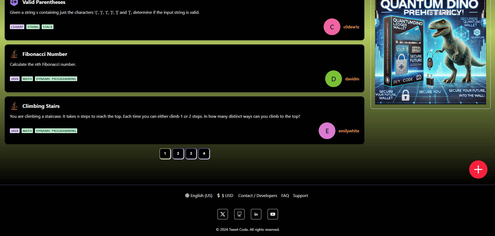
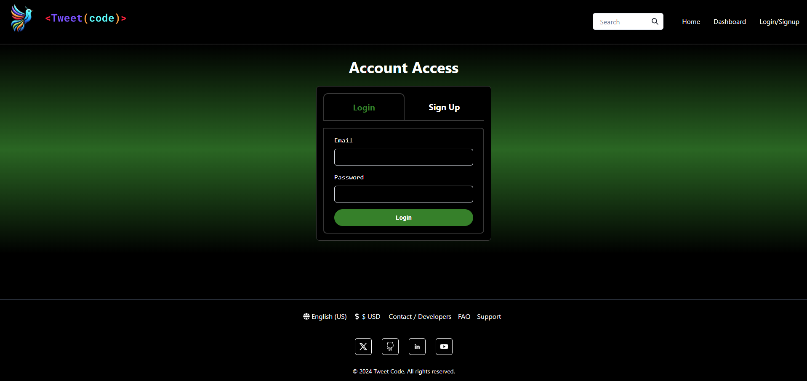
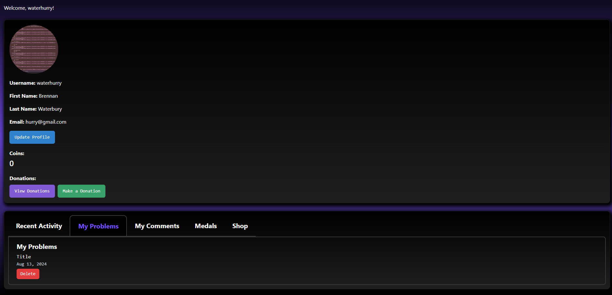
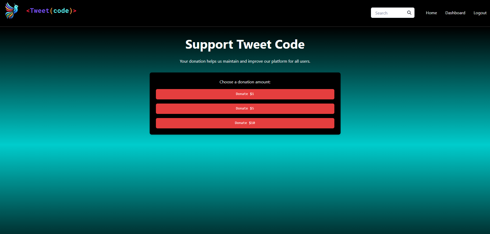
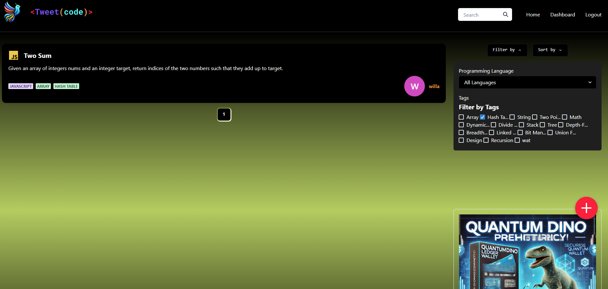
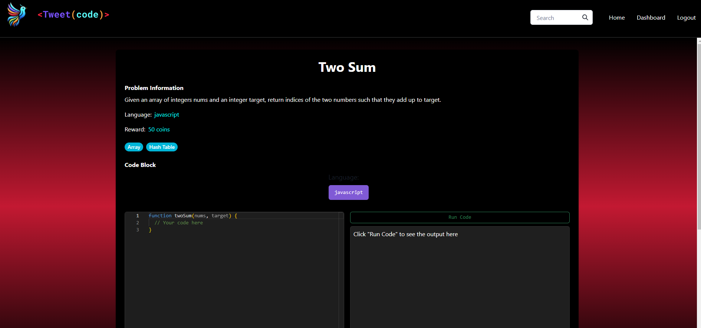
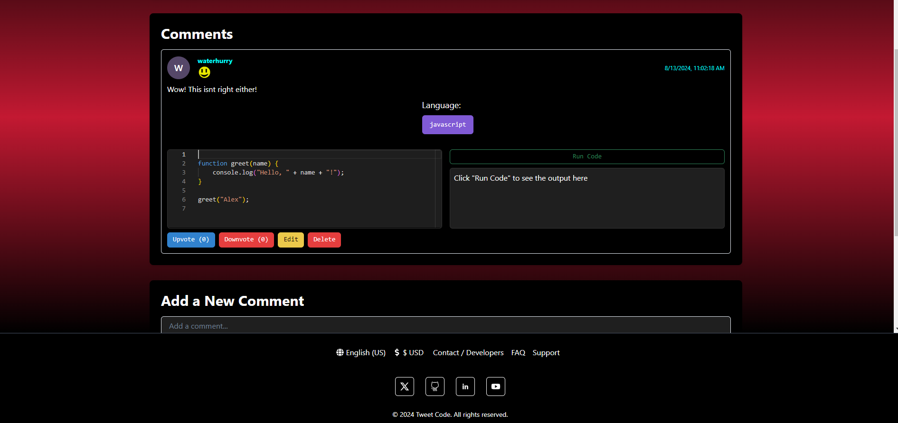
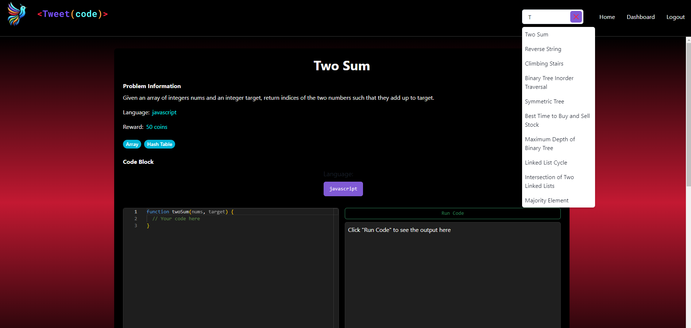
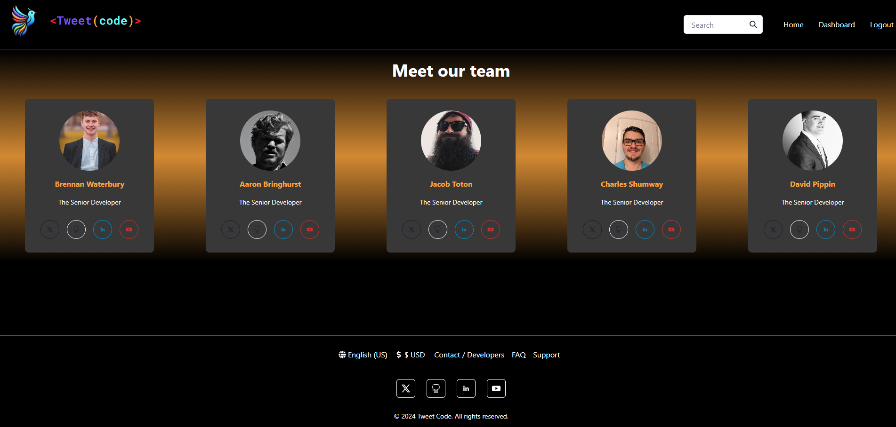
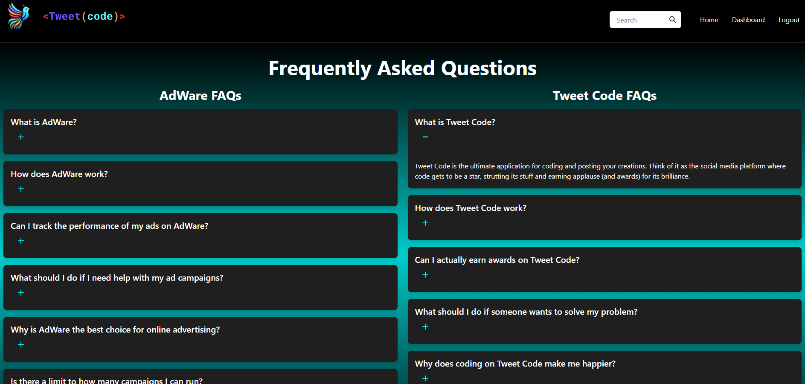

# Tweet-Code

-blue>)
-yellow>)
-darkblue>)
-red>)
-green>)
-purple>)
-Blue>)
-black>)
-orange>)
-green>)

- A mobile-first application designed to leverage modern technologies, Tweet-Code enables coders to help each other by posting and reviewing solutions to coding problems. It fosters a collaborative community where users can share knowledge, provide feedback, and earn recognition for their contributions.

## Description

- <strong>Motivation:</strong> Our motivation for building TweetCode was to create a user-friendly and interactive platform where coders can help each other by posting and reviewing solutions to coding problems. The goal was to foster a collaborative environment that encourages sharing knowledge and providing feedback.
- <strong>Purpose:</strong> This project was developed to showcase skills in creating a mobile-first application that supports a vibrant coding community. It provides a platform for users to post their solutions, engage with others through comments, and earn recognition for their contributions.
- <strong>Problem Solved:</strong> TweetCode addresses the issue of static and less engaging coding forums by offering a dynamic platform where users can interact with each other's solutions, comment, and earn awards, fostering a more interactive and supportive coding community.
- <strong>Learning Outcomes:</strong> This project provided experience in building a mobile-first React application with features such as user interactions, comment sections, and award systems. It also involved enhancing skills in UI/UX design, front-end development, and creating a collaborative environment for knowledge sharing.

## Table of Contents (Optional)

Here is a table of contents to make it easy for users to locate which section they need.

- [Installation](#installation)
- [Usage](#usage)
- [Credits](#credits)
- [License](#license)

## Installation

1. Install Required Software:

- GitBash: A command-line interface for Git.
- VS Code: An integrated development environment (IDE).
- Node.js and NPM: A JavaScript runtime and package manager.

2. Clone Your Repository:

- Open GitBash.
- Navigate to the directory where you want to store your project.
- Run `git clone <your-repo-url>` to clone the repository.

3. Open the Project in VS Code:

- Launch VS Code.
- Open the cloned repository folder.

4. Install Dependencies:

- Open the terminal in VS Code (View > Terminal or `Ctrl + ``).
- Run `npm install` to install the node_modules packages listed in your package.json.

5. Build and Start the Project:

- Run `npm run start` to start the server.

## Usage

The Tweet-Code is for managing and showcasing books, allowing employers to see my skills in building full-stack applications.

- <strong>Tweet Code Link</strong>

- [Website](https://tweet-code-ytyj.onrender.com/)

- <strong>Tweet Code Screenshots</strong>

- 
- 
- 
- 
- 
- 
- 
- 
- 
- 

## Support

N/A

## Credits

People who worked on this project were Brennan Waterbury, Aaron Bringhurst, Jacob Toton, Charles Shumway, and David Pippin. You can contact the contributors through the GitHub profiles links listed here.

- <a href="https://github.com/bwater47" alt="GitHub Link">GitHub Profile - Brennan Waterbury</a>
- <a href="https://github.com/AaronBringhurst" alt="GitHub Link">GitHub Profile - Aaron Bringhurst</a>
- <a href="https://github.com/JToton" alt="GitHub Link">GitHub Profile - Jacob Toton</a>
- <a href="https://github.com/Ownerman123" alt="GitHub Link">GitHub Profile - Charles Shumway</a>
- <a href="https://github.com/Dpippin09" alt="GitHub Link">GitHub Profile - David Pippin</a>

## License

-
- This is an [https://choosealicense.com/licenses/mit/](https://choosealicense.com/licenses/mit/) license.

## Features

<strong>Tweet Code:</strong> Tweet-Code was created to provide an interactive platform where coders can post and review solutions to coding problems using the latest web technologies.

## Contributing

Contributing is allowed if you get in contact with any of the contributors. Contact us by heading to our LinkedIns to send us a message on our GitHub Profiles.

- [Contributor Covenant](https://www.contributor-covenant.org/)

## Authors and Acknowledgment

Introduction to JSON Web Tokens. JWT.io. (07/31/24). https://jwt.io/introduction

Documentation. Mongoose. (07/31/24). https://mongoosejs.com/docs/

Tutorial V6.25.1. v6.25.1 | React Router. (07/31/24). https://reactrouter.com/en/main/start/tutorial

Quick start. React. (07/31/24). https://react.dev/learn#adding-styles

Getting started. vitejs. (07/31/24). https://vitejs.dev/guide/

NPM docs. npm Docs. (07/31/24). https://docs.npmjs.com/

CLI commands. npm Docs. (07/31/24). https://docs.npmjs.com/cli/v10/commands

Node.js V22.0.0 documentation. Command-line API | Node.js v22.0.0 Documentation. (07/31/24). https://nodejs.org/api/cli.html

MozDevNet. (07/31/24). Resources for developers, by developers. MDN Web Docs. https://developer.mozilla.org/en-US/

Bootcamp Spot. (07/31/24). https://bootcampspot.com/

W3Schools Online Web Tutorials. (07/31/24). https://www.w3schools.com/

Chatgpt. ChatGPT. (07/31/24). https://openai.com/chatgpt

• Please note: While ChatGPT was utilized to generate dialog content for the README file, it was not involved in the generation of any code, HTML edits, CSS edits, or other assets within the repository apart from this README specifically.

• All other sources, links, and information utilized within the project were obtained from the provided sources mentioned in this paragraph. This includes class materials, modules, TA guidance, instructor-provided resources, as well as communication through platforms such as Slack or Discord. Additionally, numerous links and resources were provided within the assignment instructions and demonstrated during class sessions.

## Roadmap

Tests: N/A

## Project status

In-Progress
